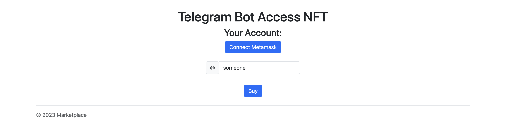
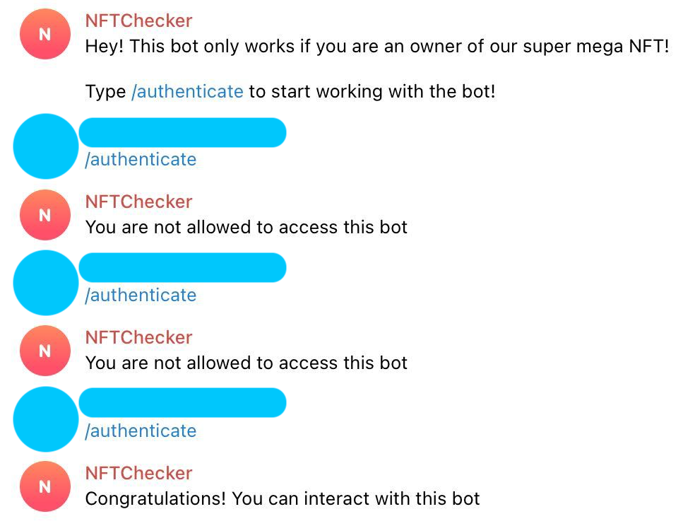

# BlockChainProject

## Description

This project implements a system with a fully-automatic
authentication system for Telegram bots.

A bot only interacts with NFT owners.

If someone wants to use the bot, they must buy
an NFT and specify their Telegram alias:


Telegram alias is saved on the blockchain, and
the bot queries the blockchain to understand if
it is allowed to interact with the user.


## Usage

### Ganache Network and Contract Deploy

Navigate to "contract" folder and deploy:

```bash
docker-compose build
docker-compose up

# Or

docker compose build
docker compose up
```

Now is the time to connect your Metamask to the deployed local blockchain.
Import any private key from the Ganache logs and you are good to go.

### Website

To run the website, replace the address of the blockchain 
and contract address you've obtained when deployed the contract to Ganache
in `backend/scripts/contract.js`. Then `cd` into `backend` folder and run:
```
npm install
noder server.js
```

### Bot

To run the bot, open `bot/bot.py` and replace all `TODO`.
They include Telegram bot token and contract address.

You might also want to change the address of your Ethereum blockchain.
